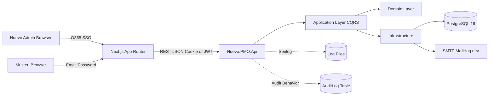

# 02 — Mimari

## Yüksek Seviye

## Clean Architecture Katmanları

### Nuevo.PMO.Domain
- Business entity'leri, value object'leri, domain event'leri, enum'lar.
- Dış bağımlılık YOKTUR (hiçbir NuGet paketine referans vermez — sadece `System.*`).

### Nuevo.PMO.Application
- Use-case'ler: CQRS style Command / Query + Handler (MediatR).
- DTO'lar, Validator'lar (FluentValidation).
- Dış dünya için interface'ler (`IAppDbContext`, `ICurrentUser`, `IPasswordHasher`, `IEmailSender`, `ITokenService`, `IDocxExporter` vs.).
- Infrastructure'a referans YOK.

### Nuevo.PMO.Infrastructure
- EF Core `AppDbContext`, entity configuration'ları.
- Repository / unit-of-work (EF Core üzerinden doğrudan).
- Email sender (SMTP), password hasher (PBKDF2), JWT token service, docx exporter (OpenXml + Markdig).
- Application katmanındaki interface'lerin somut implementasyonları.

### Nuevo.PMO.Api
- Controller'lar, middleware'ler, DI wiring, Swagger, Serilog.
- Auth handler'ları (O365 + customer JWT).
- Minimal Program.cs + `Extensions/` altında servis kayıt uzantıları.

## MediatR Pipeline Sırası

1. **LoggingBehavior** — request name + correlation id log'lar.
2. **ValidationBehavior** — FluentValidation ile validation.
3. **AuthorizationBehavior** — `[Authorize(...)]` benzeri marker attribute kontrolü.
4. **AuditBehavior** — `IAuditableCommand` implement eden command'ları audit log'a yazar.
5. **TransactionBehavior** — Write command'ları EF transaction içine alır.
6. **Handler** — asıl iş.

## Multi-Tenant İzolasyon

- Her "customer-owned" entity `CustomerId` taşır (Project, Document, Comment, Invitation, User-customer tipi).
- `AppDbContext`, `ICurrentUser` üzerinden login olmuş kullanıcının tipini ve ilgili `CustomerId`'sini okur.
- EF Core **global query filter**:
  - Nuevo kullanıcısı ise filter uygulamaz.
  - Customer kullanıcısı ise sadece kendi `CustomerId` kayıtlarını döndürür.
- Aynı filter soft delete için `!IsDeleted` da ekler.

## Error Handling

- Global `ExceptionHandlingMiddleware`:
  - `ValidationException` → 400
  - `NotFoundException` → 404
  - `ForbiddenException` → 403
  - `DomainException` → 422
  - Diğer → 500
- Yanıt formatı RFC7807 `ProblemDetails` + `traceId` + `errors[]`.

## Logging

- Serilog, JSON format, stdout + rolling file (`logs/app-.log`).
- `CorrelationIdMiddleware` her request'e `X-Correlation-Id` yazar ve `LogContext`'e push'lar.
- `UserId`, `CustomerId`, `RequestPath`, `Method`, `StatusCode`, `Elapsed` enrichment.

## Audit Log

- Tablo: `audit_logs` (`Id, UserId, Action, EntityType, EntityId, BeforeJson, AfterJson, IpAddress, CreatedAt`).
- Doldurma kaynağı:
  - **MediatR AuditBehavior:** `IAuditableCommand` implement eden command'lar (before/after snapshot).
  - **Middleware (fallback):** `POST/PUT/PATCH/DELETE` isteklerinin metadata'sını yazar.
- Okuma: sadece Nuevo admin'lerine görünür (ileride admin UI'da).

## Deployment Hedefi (Dev)

- `docker compose up -d postgres mailhog`
- `dotnet run --project backend/src/Nuevo.PMO.Api`
- `npm run dev --prefix frontend`
