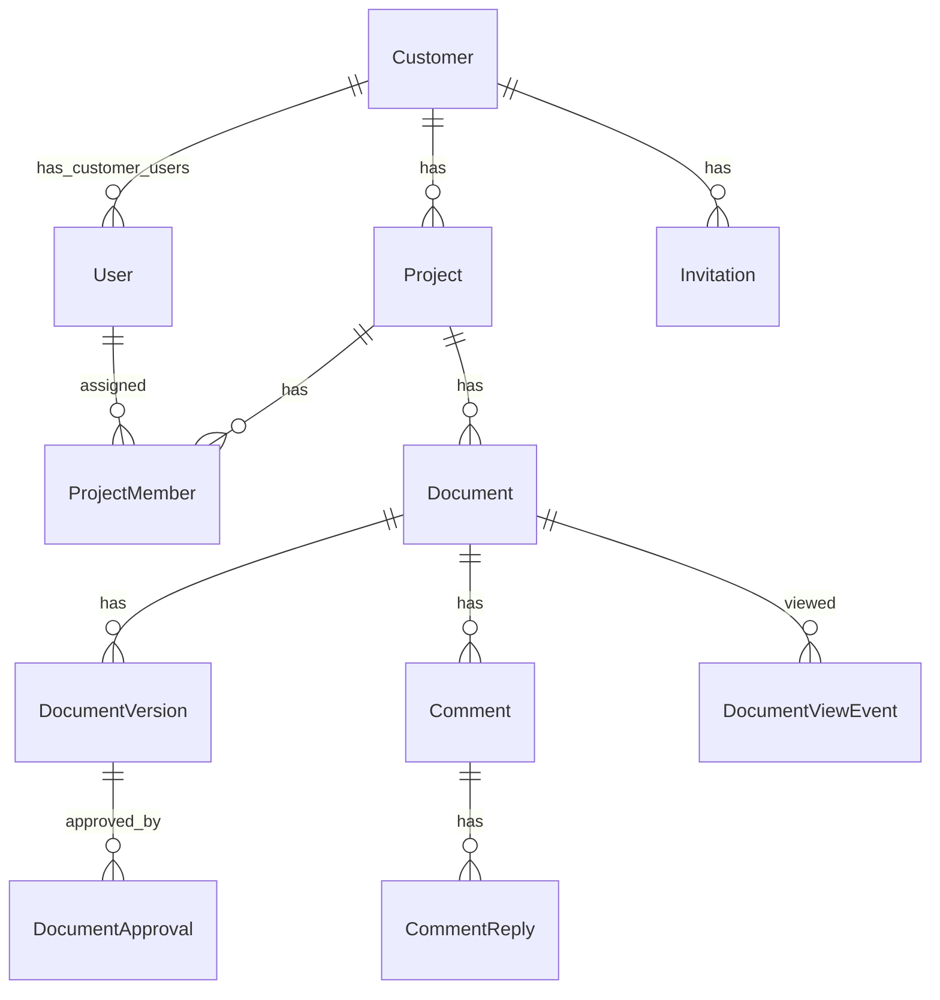

# 03 — Domain Modeli

## Aggregate / Entity Listesi

| Entity              | Amaç                                             |
|---------------------|--------------------------------------------------|
| `User`              | Nuevo veya müşteri kullanıcısı                   |
| `Customer`          | Müşteri şirketi                                  |
| `Project`           | Nuevo'nun yürüttüğü proje                        |
| `ProjectMember`     | Kullanıcının projedeki rolü (N-N)                |
| `Document`          | Proje altındaki bir doküman (head metadata)      |
| `DocumentVersion`   | Her save ile oluşan versiyon (content)           |
| `DocumentApproval`  | Müşteri versiyon onayı                           |
| `Comment`           | Bloğa pinlenmiş yorum                            |
| `CommentReply`      | Yorum altında cevap                              |
| `DocumentViewEvent` | Müşteri/kullanıcı görüntüleme kaydı + süre       |
| `Invitation`        | Müşteri onboarding token'ı                       |
| `AuditLog`          | Tüm write işlemlerinin kaydı                     |

## Alan Detayları

### BaseEntity
- `Id` (Guid, PK)
- `CreatedAt` (UTC)
- `CreatedBy` (Guid?)
- `UpdatedAt` (UTC?)
- `UpdatedBy` (Guid?)
- `IsDeleted` (bool)
- `DeletedAt` (UTC?)

### User
- `Email` (unique, lower-cased)
- `DisplayName`
- `UserType` — `Nuevo` | `Customer`
- `ExternalId` (O365 object id, Nuevo için)
- `PasswordHash`, `PasswordSalt` (Customer için)
- `CustomerId` (Customer ise)
- `IsActive`
- `LastLoginAt`

### Customer
- `Name`
- `ContactEmail`

### Project
- `Code` (unique, örn. "NUEVO-2026-001")
- `Name`
- `Description`
- `CustomerId`
- `Status` — `Active` | `OnHold` | `Completed` | `Cancelled`

### ProjectMember
- `ProjectId`
- `UserId`
- `Role` — `PMOwner` | `PMOMember` | `CustomerViewer` | `CustomerContributor`

### Document
- `ProjectId`
- `Title`
- `Type` — `Analysis` | `Scope` | `Meeting` | `Other`
- `CurrentDraftVersionId` (en son kaydedilen draft)
- `PublishedVersionId` (müşterinin gördüğü)
- `ApprovedVersionId` (müşterinin onayladığı)

### DocumentVersion
- `DocumentId`
- `VersionNumber` — string, örn. `"2.1"` (major = published count, minor = draft count since last publish)
- `ContentJson` — ProseMirror JSON (block'lar + blockId'ler)
- `ContentMarkdown` — markdown export (turndown tarafından üretilmiş)
- `IsPublished` (bool)
- `PublishedAt` (UTC?)
- `PublishedBy` (Guid?)

### DocumentApproval
- `DocumentVersionId`
- `ApprovedBy` (Customer User Id)
- `ApprovedAt`
- `Note`

### Comment
- `DocumentId`
- `VersionId` — yorum hangi versiyonda açıldı
- `BlockId` — Tiptap blockId (UUID)
- `AnchorText` — bloğun snapshot'ı (görsel fallback için)
- `Body`
- `Status` — `Open` | `Resolved` | `Orphaned`
- `ResolvedBy`, `ResolvedAt`

### CommentReply
- `CommentId`
- `Body`

### DocumentViewEvent
- `DocumentId`
- `DocumentVersionId`
- `UserId`
- `SessionId` (Guid) — bir oturum/tab için
- `OpenedAt`
- `LastHeartbeatAt`
- `DurationSeconds` (hesaplanan)

### Invitation
- `Email`
- `CustomerId`
- `Token` (hash'lenmiş)
- `ExpiresAt`
- `AcceptedAt`
- `AcceptedUserId`

### AuditLog
- `UserId` (nullable — anonymous call'lar için)
- `Action` — örn. "ProjectCreated"
- `EntityType`, `EntityId`
- `BeforeJson`, `AfterJson`
- `IpAddress`, `UserAgent`
- `CorrelationId`

## İlişkiler (Özet)

## Versiyon Numarası Stratejisi

- Doküman oluştuğunda ilk versiyon `1.0` (draft).
- Her `Save` → minor++ → `1.1`, `1.2` ...
- `Publish` → yeni versiyon yerine mevcut en son drafti published yapar; sonraki draft `2.0`, `2.1` ... şeklinde başlar (yani major = publish sayısı + 1).
- `Approve` sadece published versiyonlarda yapılır.

## Blok ID Stratejisi

- Frontend (Tiptap) her yeni blok eklendiğinde UUID üretir ve `attrs.blockId` olarak tutar.
- Save sırasında JSON olarak serialize edilir.
- Yeni versiyonda aynı blockId bulunursa yorum `Open` olarak taşınır; bulunamazsa `Orphaned` status'una düşer.

## Soft Delete

- Tüm entity'ler `IsDeleted` + `DeletedAt` ile soft delete.
- EF Core query filter `!IsDeleted` zorunlu olarak uygular.
- Hard delete yalnızca `AuditLog` ve teknik loglarda yoktur; gerektiğinde SQL migration'ıyla yapılır.
