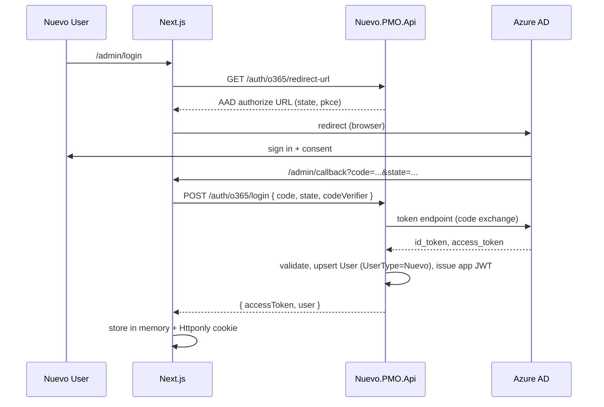
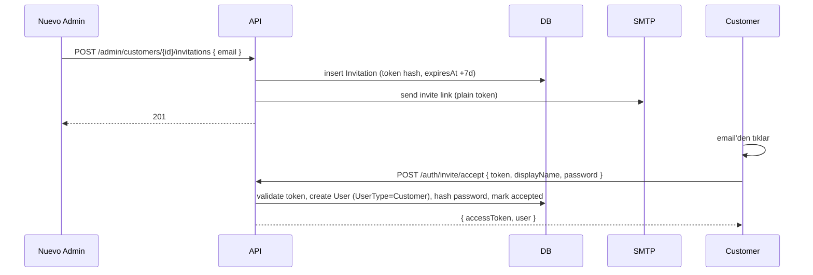
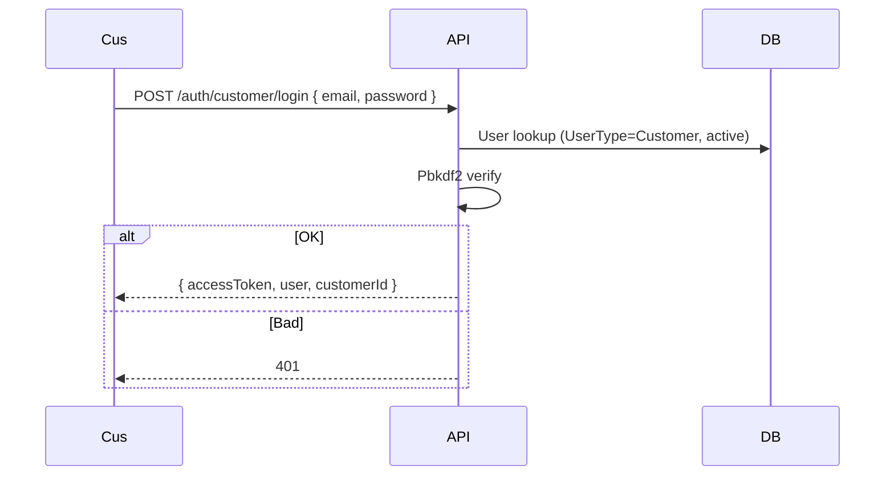

# 05 — Auth Flow'ları

## 1. Nuevo Admin — O365 SSO (Authorization Code + PKCE)

**Notlar**
- Backend `Microsoft.Identity.Web` ile code exchange yapar.
- App JWT `UserId, Email, UserType=Nuevo` claim'leri taşır; 60 dakika TTL.
- Refresh MVP'de yok; süresi dolunca tekrar login.

## 2. Müşteri Davet + İlk Giriş

**Notlar**
- `Invitation.Token` DB'de hash olarak tutulur (`SHA256` + salt); mail'deki link plain.
- Expiration: 7 gün default (config'den).
- Parola: minimum 10 karakter, en az bir rakam + bir harf (FluentValidation).

## 3. Müşteri Login

## 4. Authorization

- **Policy:** `NuevoOnly` → `UserType == Nuevo`.
- **Policy:** `CustomerOnly` → `UserType == Customer`.
- **Resource-based:** `IAuthorizationHandler` `ProjectMemberRequirement`:
  - Nuevo kullanıcı → `ProjectMember` kaydı varsa OK.
  - Customer kullanıcı → `Project.CustomerId == user.CustomerId` ve `ProjectMember` kaydı varsa OK.
- **Write endpoint'ler:** Nuevo için `PMOwner`/`PMOMember` rolleri, customer için `CustomerContributor` (yorum, approve) yeterli; `CustomerViewer` yalnızca okuma.

## 5. Şifre Hash

- PBKDF2, SHA256, 100000 iterasyon, 16 byte salt, 32 byte key.
- `PasswordHash = base64(salt) + "." + base64(key)`.

## 6. Token (JWT) Claim'leri

- `sub` — UserId
- `email`
- `name`
- `user_type` — `Nuevo` | `Customer`
- `customer_id` — müşteri ise
- `iat`, `exp`
