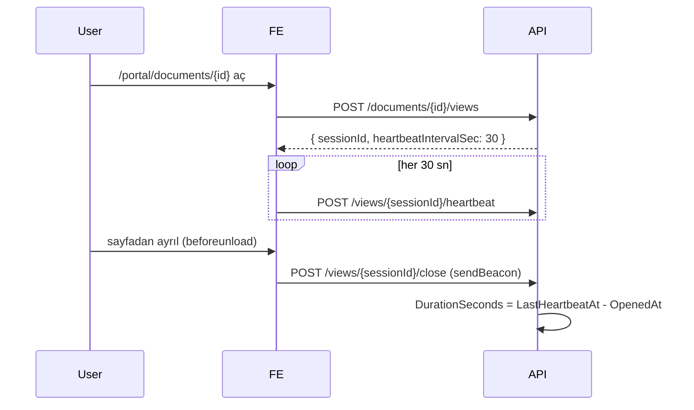

# 06 — Editor, Versiyon ve Yorum Sistemi

## Editor

- **Kütüphane:** Tiptap (ProseMirror tabanlı).
- **Öne çıkan özellikler:**
  - Heading (H1-H3), paragraph, bold/italic/strike, bullet/ordered list, blockquote, code block, link, table, horizontal rule.
  - Markdown paste / paste-as-html dönüştürme.
  - Placeholder extension.
  - Custom `BlockId` extension: her block-level node'a `attrs.blockId` (UUID) ekler; yeni block eklendiğinde otomatik üretilir.

## Block ID Üretim Kuralı

- Frontend'de `transaction` listener her save/interaction'da:
  - Yeni blok varsa `blockId` yoksa → UUID üret.
  - Split (paragrafı ikiye bölme) → yeni parça yeni `blockId` alır, eski korur.
  - Merge → hangisinin korunacağı: üsttekinin `blockId`'si kalır, alttaki atılır.

## Kaydetme

- **Save trigger:** Kullanıcı "Save draft" butonuna basınca VEYA 30 saniye sonra auto-save (MVP'de sadece manual).
- **Payload:** `{ contentJson, contentMarkdown }`.
- **Backend:**
  - Yeni `DocumentVersion` yaratır (IsPublished=false).
  - VersionNumber hesaplanır: Major = (son published version.major) + 1 eğer draft sayısına göre; minor = bu major içindeki draft sayısı + 1.
    - Basit: Hiç publish yoksa `1.0`, `1.1`, `1.2`. İlk publish `1.X` olarak kalır. Sonraki ilk yeni draft `2.0`, `2.1`...
  - `Document.CurrentDraftVersionId` güncellenir.
  - Comment migration çalışır (aşağıda).

## Publish

- `POST /documents/{id}/versions/{versionId}/publish`
- Seçilen version `IsPublished=true`, `Document.PublishedVersionId` bu version olur.
- Sonraki draft'ların major'ı (publishedCount+1) ile devam eder.

## Version Approval

- Customer `POST /documents/{id}/versions/{versionId}/approve { note }`.
- Sadece published version onaylanabilir.
- `DocumentApproval` eklenir; aynı user aynı version'u ikinci kez onaylayamaz.
- `Document.ApprovedVersionId` = son approval'ın version'ı (display için).

## Word Export

- `GET /documents/{id}/export.docx?versionId=...`
- Backend:
  1. `ContentMarkdown` al.
  2. Markdig ile HTML'e çevir.
  3. OpenXml kullanarak `.docx` oluştur:
     - Başlık → Heading style.
     - Paragraph → Normal.
     - List → Numbered/Bullet.
     - Table → Basic table.
  4. Stream olarak döndür.

## Comment Sistemi

### Ekleme (Customer)

1. Customer readonly editor'da bir bloğu seçer.
2. "Comment" butonu → `CreateComment` modal.
3. Frontend: `{ documentId, versionId, blockId, anchorText, body }`.

### Cevaplama

- `POST /comments/{id}/replies` — Nuevo veya Customer.

### Resolve / Reopen

- Sadece Nuevo kullanıcıları `PATCH /comments/{id}/resolve` yapabilir.
- Reopen aynı şekilde Nuevo yetkisinde.

### Version Değişince Migration

- Yeni version kaydedildiğinde backend:
  1. Önceki version'daki `Open` ve `Orphaned` durumundaki comment'leri çek.
  2. Yeni version `ContentJson` içinde aynı `blockId` taşıyan block var mı bak.
  3. Var → `Comment.VersionId = newVersionId` (otomatik taşı).
  4. Yok → `Status = Orphaned`, `VersionId` değişmez.

### UI

- **Editor sağ paneli:** "Comments (N open)" listesi.
- **Inline:** Block'un yanında küçük comment rozet; tıklayınca panel açılır.
- **Filter:** open / resolved / orphaned.

## Analytics Flow

**Fallback:** `close` çağrısı gelmezse `DurationSeconds` = `LastHeartbeatAt - OpenedAt` şeklinde tutulur.
